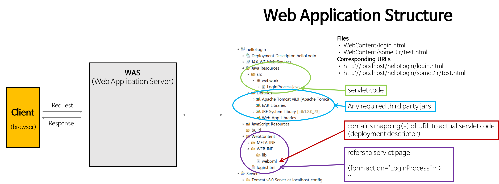
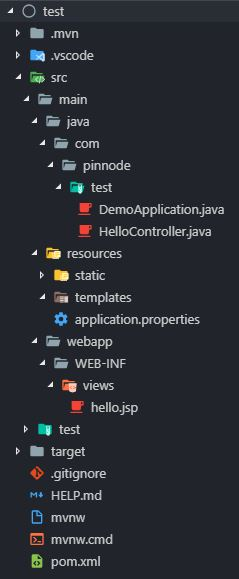

# MVC

## 1. Web Application Structure





### 1\) src

개발자가 작성한 `Servlet`코드가 저장된다,.

### 2\) libraries

`Servlet`이나 `JSP`에서 추가로 사용하는 라이브러리 또는 드라이버, jar로 압축한 파일이어야 한다.

### 3\) webapp\(=WebContent\)

`Deploy` 할 때 `WebConcontent` 디렉토로리 전체가 `.war`로 묶어서 보내진다

#### : WEB-INFO\(=WebContent\)

> #### lib
>
> 추가한 모든 라이브러리 또는 드라이버가 이곳에 모두 저장된다.
>
> #### classes
>
> 작성한 `Java Servlet` 파일이 나중에 `.class`로 이곳에 모두 저장된다.
>
> #### web.xml
>
> SUN에서 정해놓은 규칙에 맞게 자겅해야 하며 모든 `WAS`에 대하여 작성 방법이 동일하다.

#### : .html 파일들

관련된 `HTML` 소스를 저장한다.

## 2. web.xml 기본 설정

### 1\) 개념

web application의 설정을 위한 `deployment descriptor`

### 2\) 역할

`Deploy` 할 때 `Servlet`의 정보를 설정해준다.

브라우저가 `Java Servlet`에 접근하기 위해서는 WAS\(Ex. Tomcat\)에 필요한 정보를 알려줘야 해당하는 `Servlet`을 호출할 수 있다.

1. 배포할 `Servlet`이 무엇인지
2. 해당 `Servlet`이 어떤 URL에 매핑되는지



```markup
<web-app>

    <!-- 1. aliases 설정 -->
    <servlet>
        <servlet-name>welcome</servlet-name>
        <servlet-class>servlets.WelcomeServlet</servlet-class>
    </servlet>
    
    <!-- 2. 매핑 -->
    <servlet-mapping>
        <servlet-name>welcome</servlet-name>
        <url-pattern>/welc
ome</url-pattern>
    </servlet-mapping>
    
</web-app>
```



### 

